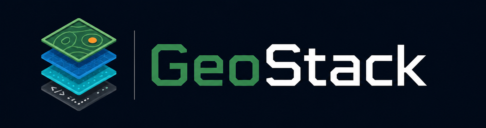

<p align="center">
  <a href="README.md">🇬🇧 English</a>
</p>

<p align="center">
  
</p>

<p align="center">
  
</p>

# Geostack

Platform data geospasial multi-tenant untuk perencanaan jaringan telekomunikasi.

**Demo langsung:** [geostack.faisalaffan.com](https://geostack.faisalaffan.com) — login dengan `demo_admin` / `demo123`

## Fitur

- **Isolasi multi-tenant** — Skema PostgreSQL per organisasi, realm Keycloak, autentikasi JWT
- **ETL spasial** — Unggah shapefile/GeoJSON/GeoTIFF, proses otomatis via GDAL, muat ke PostGIS
- **Tile serving** — Vektor (Martin), raster (TiTiler), standar OGC (GeoServer)
- **Peta interaktif** — MapLibre GL JS dengan toggle layer, popup klik, tabel atribut
- **Object storage** — MinIO kompatibel S3

## Arsitektur

```
 React (Vite) ──▶ Fastify API ──▶ PostgreSQL/PostGIS
   :5173            :3000            :5432
                      │
       ┌──────────────┼──────────────┐
       ▼              ▼              ▼
    Martin         TiTiler       GeoServer       Keycloak
    :3001          :3002         :8080            :8081
       │              │              │
       └──────────────┼──────────────┘
                      ▼
                   MinIO
                   :9000
```

## Mulai Cepat

```bash
git clone git@github.com:faisalaffan/geostack.git && cd geostack
cp .env.example .env
make setup        # install + start + migrate
```

Buka http://localhost:5173. Login dev tersedia di frontend.

Admin Keycloak di http://localhost:8081/admin (`admin` / `admin`).

## Tech Stack

| Kategori | Teknologi |
|----------|-----------|
| Backend | Node.js, TypeScript, Fastify |
| Frontend | React, Vite, Tailwind CSS, MapLibre GL JS |
| Database | PostgreSQL 16 + PostGIS 3.4 |
| Auth | Keycloak (OAuth2/OIDC) |
| Tile Services | Martin, TiTiler, GeoServer |
| Storage | MinIO (kompatibel S3) |
| Infra | Docker Compose (8 service), manifes Kubernetes |

## Pengembangan

```bash
make help          # semua perintah

# Backend (backend/)
pnpm dev           # dev server (butuh Docker services menyala)
pnpm test

# Frontend (frontend/)
pnpm dev           # Vite HMR
pnpm test
```

## Lisensi

MIT
